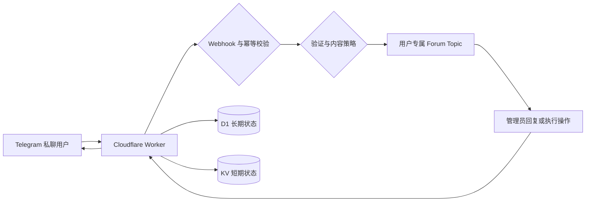

# Telegram Private Chat Gateway

> 部署在 Cloudflare Workers 上的 Telegram 私聊安全接入与双向会话网关。

[](https://deploy.workers.cloudflare.com/?url=https://github.com/Silentely/telegram-private-chat-gateway)


[English](README_EN.md) | [简体中文](README.md)

Telegram Private Chat Gateway 将机器人收到的私聊安全地接入 Telegram Forum Topic。每位用户拥有独立会话，管理员可以在群组内统一回复、管理用户状态并审计关键操作，而无需维护服务器。

## 为什么使用

- **集中处理私聊**：每位用户自动对应一个 Forum Topic，避免消息混在普通群聊中。
- **降低骚扰风险**：支持人机验证、关键词、链接、重复消息和动态规则策略。
- **控制管理权限**：Owner、Operator 和 Rules Manager 使用明确的角色权限。
- **保持消息可追踪**：D1 保存用户、Topic、消息映射、规则、管理员和审计记录。
- **无服务器运行**：部署在 Cloudflare Workers，KV 保存短期状态，Cron 自动清理过期数据。

## 核心能力

| 能力 | 说明 |
|------|------|
| 双向会话 | 私聊消息进入独立 Forum Topic，管理员回复会发送回对应用户 |
| 安全 Webhook | 校验 Telegram Secret Token、JSON Content-Type 和 1 MiB 请求体限制 |
| 幂等处理 | 同一个 Telegram Update 只处理一次，失败任务可按状态重试 |
| 人机验证 | 支持 Cloudflare Turnstile，并可在未配置时使用本地题库 |
| 内容策略 | 支持屏蔽词、链接限制、重复消息检测和 D1 动态规则 |
| 用户管理 | 支持信任、封禁、关闭会话、静音和资料卡状态查看 |
| 角色权限 | 支持恢复 Owner、Operator 和 Rules Manager 权限模型 |
| 数据与审计 | D1 保存长期状态，管理员关键操作写入审计记录 |
| 可观测性 | 结构化 JSON 日志自动脱敏正文、凭据和验证挑战标识 |
| 定时维护 | Cron 按保留期清理幂等记录、消息映射和管理员审计 |

## 工作流程



1. Telegram 使用带 Secret Token 的 Webhook 将 Update 发送到 Worker。
2. Worker 完成请求校验、幂等声明、验证状态和内容策略检查。
3. 合法消息被复制到对应用户的 Forum Topic；不存在 Topic 时通过并发锁安全创建。
4. 管理员在 Topic 中回复用户，或通过资料卡执行授权操作。
5. D1 保存长期状态和审计，KV 保存验证、速率限制和短期缓存。

## 五分钟快速部署

### 1. 获取项目并安装依赖

```bash
git clone https://github.com/Silentely/telegram-private-chat-gateway.git
cd telegram-private-chat-gateway
npm install
```

### 2. 创建 Cloudflare 资源

- 创建 KV Namespace，并绑定为 `TOPIC_MAP`。
- 创建 D1 Database，并绑定为 `TG_BOT_DB`。
- 在 `wrangler.toml` 中填写自己的资源 ID。

### 3. 配置 Secrets 和变量

```bash
npx wrangler secret put BOT_TOKEN
npx wrangler secret put WEBHOOK_SECRET
```

同时配置：

- `SUPERGROUP_ID`：开启 Topics 的 Telegram 超级群组 ID，必须以 `-100` 开头。
- `OWNER_IDS`：恢复 Owner 用户 ID，多个 ID 使用逗号分隔，强烈建议配置。

### 4. 检查并部署

```bash
npm test
npx wrangler deploy --dry-run
npm run deploy
```

### 5. 设置 Telegram Webhook

```text
https://api.telegram.org/bot<BOT_TOKEN>/setWebhook?url=<WORKER_URL>&secret_token=<WEBHOOK_SECRET>&allowed_updates=%5B%22message%22,%22edited_message%22,%22callback_query%22%5D
```

完整资源创建、Cron 和发布后验证步骤请查看[部署指南](docs/deployment.md)。

## 架构概览

项目使用 ES Modules，并将入口、安全守卫、会话、策略、Telegram API、存储和维护职责拆分为独立模块：

- `worker.js`：Telegram 业务编排和 Worker 导出入口。
- `src/app.js`：HTTP 请求校验、幂等路由和 Scheduled 入口。
- `src/conversation-service.js`：Topic 生命周期、双向消息和资料同步。
- `src/admin-service.js`：角色授权、资料卡操作、规则管理和审计。
- `src/message-policy.js`：内容分类、规则校验和消息策略评估。
- `src/storage/`：D1、KV、短期状态和 Schema migrations。
- `src/telegram-client.js`：Telegram API 超时、重试和错误分类。

详细模块边界和数据流请查看[系统架构](docs/architecture.md)。

## 文档导航

- [完整部署](docs/deployment.md)
- [配置参考](docs/configuration.md)
- [系统架构](docs/architecture.md)
- [运维指南](docs/operations.md)
- [开发指南](docs/development.md)
- [安全设计](docs/security.md)
- [更新历史](CHANGELOG.md)

## 项目状态

- 当前版本：`1.0.0`
- 运行环境：Cloudflare Workers ES Modules
- 长期存储：Cloudflare D1
- 短期状态：Cloudflare KV
- 测试框架：Vitest
- 主要语言：JavaScript

项目提供单元测试、集成测试、覆盖率检查、文档同步脚本和 Wrangler dry-run。真实 Telegram Bot 权限、Cloudflare Bindings 和 Cron 仍应在预发布 Worker 中验证。

## 安全提示

- 使用 `wrangler secret put` 保存 `BOT_TOKEN`、`WEBHOOK_SECRET` 和 Turnstile Secret。
- `WEBHOOK_SECRET` 必须是至少 32 字节的高熵随机值。
- 不要在仓库、日志、Issue 或聊天记录中提交真实凭据。
- 不要将 Vitest UI 或本地 Wrangler 开发服务直接暴露到公网。
- 发布前阅读[安全设计](docs/security.md)并完成[运维检查清单](docs/operations.md)。

## License

本项目基于 [MIT License](LICENSE) 发布。
