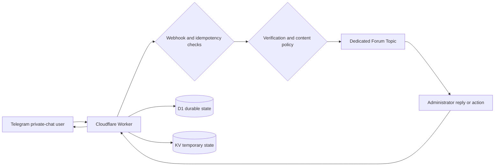

# Telegram Private Chat Gateway

> A secure Telegram private-chat gateway built on Cloudflare Workers.


[English](README_EN.md) | [简体中文](README.md)

Telegram Private Chat Gateway securely routes bot private chats into Telegram Forum Topics. Each user receives an isolated conversation, while administrators can reply, manage user state, and audit sensitive operations from one group without maintaining a server.

## Why Use It

- **Centralized private chats**: Each user is mapped to a dedicated Forum Topic.
- **Reduced abuse**: Human verification, keyword filtering, link controls, repeated-message detection, and dynamic rules.
- **Controlled administration**: Explicit Owner, Operator, and Rules Manager permissions.
- **Traceable state**: D1 stores users, Topics, message links, rules, administrators, and audits.
- **Serverless operation**: Cloudflare Workers runs the gateway, KV stores temporary state, and Cron removes expired records.

## Core Capabilities

| Capability | Description |
|------------|-------------|
| Two-way conversations | Private messages enter a dedicated Forum Topic; administrator replies return to the correct user |
| Secure Webhook | Validates the Telegram Secret Token, JSON Content-Type, and a 1 MiB request-body limit |
| Idempotent processing | Each Telegram Update is processed once, with explicit retryable failure state |
| Human verification | Supports Cloudflare Turnstile and a local question set when Turnstile is not configured |
| Content policy | Blocked words, link controls, repeated-message detection, and D1-backed dynamic rules |
| User management | Trust, ban, close, mute, and profile-card status actions |
| Role permissions | Recovery Owners, Operators, and Rules Managers |
| Data and audits | Durable D1 state with administrator audit records |
| Observability | Structured JSON logs redact message content, credentials, and verification challenge identifiers |
| Scheduled maintenance | Cron removes expired idempotency records, message links, and administrator audits |

## How It Works



1. Telegram sends an Update to the Worker through a Secret Token-protected Webhook.
2. The Worker validates the request, claims the Update, and evaluates verification and content policy.
3. An accepted message is copied into the user's Forum Topic; a concurrency lock protects Topic creation.
4. Administrators reply in the Topic or use authorized profile-card actions.
5. D1 stores durable state and audits, while KV stores verification, rate limits, and temporary caches.

## Five-Minute Deployment

Supported release path only: **build `dist/worker.single.js` → paste into the Cloudflare Worker editor → configure Bindings and variables in the Dashboard**.  
Do not use `wrangler deploy` or Cloudflare Git auto-deploy for production.

### 1. Get the project and install dependencies

```bash
git clone https://github.com/Silentely/telegram-private-chat-gateway.git
cd telegram-private-chat-gateway
npm install
```

### 2. Confirm the single-file bundle

The repository ships `dist/worker.single.js`. Rebuild after source changes (pre-commit also rebuilds on commit):

```bash
npm run build:single
```

### 3. Paste into the Cloudflare Worker

1. Dashboard → **Workers & Pages** → create or open a Worker  
2. **Edit code** → paste the full contents of `dist/worker.single.js` → **Deploy**  

### 4. Configure resources in the Dashboard (once)

| Setting | Requirement |
|---------|-------------|
| Binding `TOPIC_MAP` | **KV Namespace** |
| Binding `TG_BOT_DB` | **D1 Database** (not a Text variable) |
| Secrets `BOT_TOKEN` / `WEBHOOK_SECRET` | Secrets; webhook secret ≥ 32 bytes |
| Text `SUPERGROUP_ID` | Must start with `-100` |
| Text `OWNER_IDS` | Recovery owners; strongly recommended |
| Cron | Recommended: `0 3 * * *` |

Do not put leading spaces in variable names. Full reference: [configuration](docs/configuration.md).

### 5. Register the Telegram Webhook

```text
https://api.telegram.org/bot<BOT_TOKEN>/setWebhook?url=<WORKER_URL>&secret_token=<WEBHOOK_SECRET>&allowed_updates=%5B%22message%22,%22edited_message%22,%22callback_query%22%5D
```

See the [deployment guide](docs/deployment.md) for the full walkthrough and post-deploy checks.

## Architecture Overview

The project uses ES Modules and separates HTTP security, conversations, policy, Telegram API access, storage, and maintenance responsibilities:

- `worker.js`: Telegram orchestration, verification, media groups, and Worker export; wires admin board handlers.
- `src/app.js`: HTTP validation, idempotent routing, and the Scheduled entry.
- `src/conversation-service.js`: Topic lifecycle, two-way messages, and profile synchronization.
- `src/admin-service.js`: Role authorization, profile-card (`v1:*`) actions, rules, and audits.
- `src/admin-commands.js` / `admin-ui-format.js` / `activity-summary.js`: Group admin menu, sysinfo/stats/rank, and CST stats UI.
- `src/verify-copy.js` / `user-copy.js`: User-facing verification and intercept copy.
- `src/message-policy.js`: Content classification, rule validation, and policy evaluation.
- `src/storage/`: D1, KV, temporary state, and schema migrations.
- `src/telegram-client.js`: Telegram API timeouts, retries, and error classification.

See [system architecture](docs/architecture.md) for module boundaries and data flows.

## Admin commands (quick reference)

In the supergroup (sender must be group creator/admin, `ADMIN_IDS`, or `OWNER_IDS`). Full detail: [operations](docs/operations.md).

| Entry | Purpose |
|-------|---------|
| `/menu` | Button home (recommended) |
| `/sysinfo` | System pages: overview / storage / errors / today / activity |
| `/stats` | Today stats (CST day boundary, vs yesterday, 7-day sparkline + peak days, heat) |
| `/rank` | Today active ranking + CST hourly heat; open user panel from buttons |
| `/find query` | Find by UID / username / name |
| `/notes query` | Search admin notes |
| `/panel` `/info` | In-user topic: action panel and profile |
| `/ban` `/close` `/reset` | Require confirmation; also mute / open / trust, etc. |
| `/synccommands` | Owner-only: register Bot slash command menu |

Stats and heat use **China time CST (UTC+8)**. End users only get `/start`, `/help`, and the verification flow.

After deploying a new `dist/worker.single.js`, Owners should run `/synccommands` again.

## Documentation

- [Deployment](docs/deployment.md)
- [Configuration](docs/configuration.md)
- [Architecture](docs/architecture.md)
- [Operations](docs/operations.md)
- [Development](docs/development.md)
- [Security](docs/security.md)
- [Changelog](CHANGELOG.md)

## Project Status

- Current version: `1.0.0`
- Runtime: Cloudflare Workers ES Modules
- Durable storage: Cloudflare D1
- Temporary state: Cloudflare KV
- Test framework: Vitest
- Primary language: JavaScript

The project includes unit tests, integration tests, coverage checks, single-file bundling, and a pre-commit hook that rebuilds `dist/`. Telegram Bot permissions, Cloudflare Bindings, and Cron should still be validated on a staging Worker.

## Security

- Store `BOT_TOKEN`, `WEBHOOK_SECRET`, and the Turnstile Secret under Dashboard **Variables and Secrets**.
- Use a high-entropy `WEBHOOK_SECRET` of at least 32 bytes.
- Never commit real credentials to the repository, logs, issues, or chat messages.
- Do not expose the Vitest UI or a local development server directly to the internet.
- Review the [security design](docs/security.md) and [operations checklist](docs/operations.md) before release.

## License

This project is released under the [MIT License](LICENSE).
